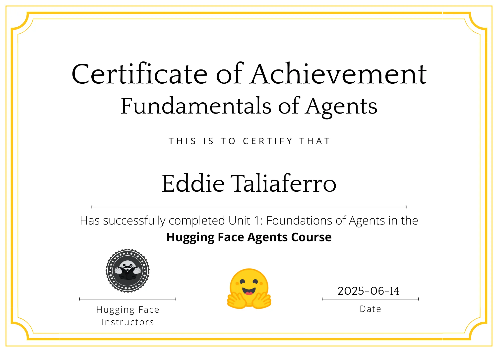

# HuggingFace Learning

This shows my Journey doing the HuggingFace, AI Agent Course and Certification:

[Hugging Face AI Agent Course](https://huggingface.co/learn/agents-course/unit0/introduction)

## Resources
- [Chroma](https://www.trychroma.com/eddielacrosse2)
- [Langfuse](https://cloud.langfuse.com/)
- [LlamaHub](https://llamahub.ai/)
- [Async Python](https://docs.llamaindex.ai/en/stable/getting_started/async_python/)
- [LlamaIndex](https://www.llamaindex.ai/)
- [LangGraph](https://langchain-ai.github.io/langgraph/)

## Certifications
